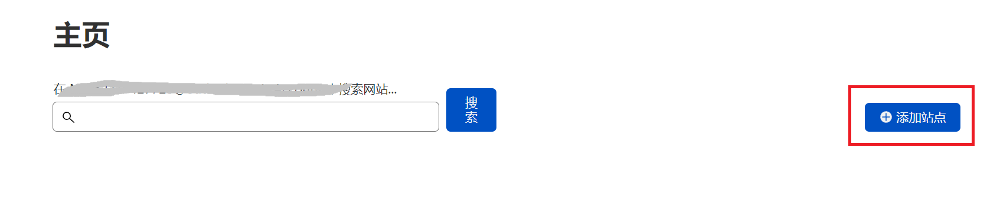
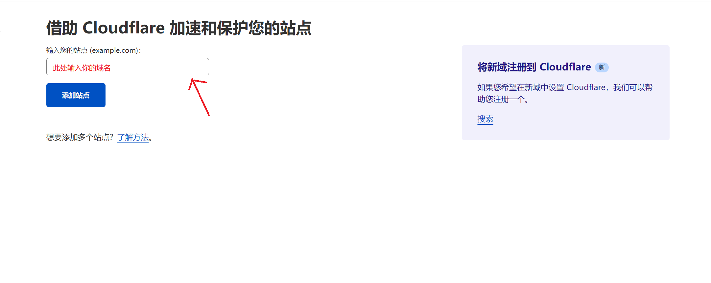
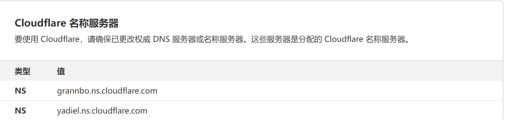
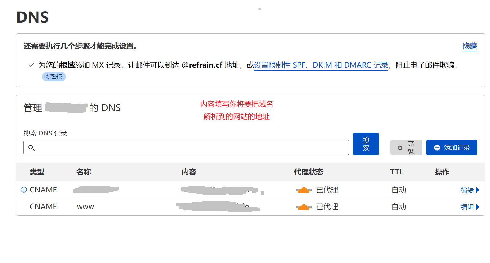
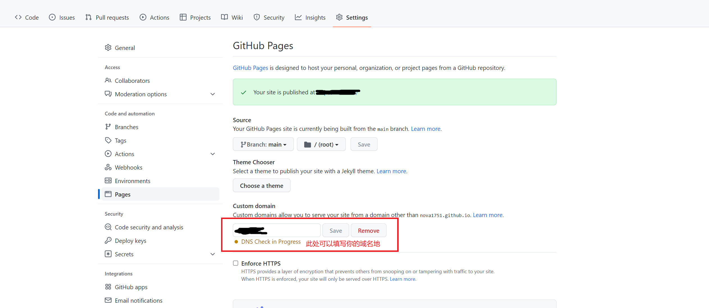
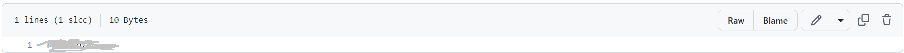
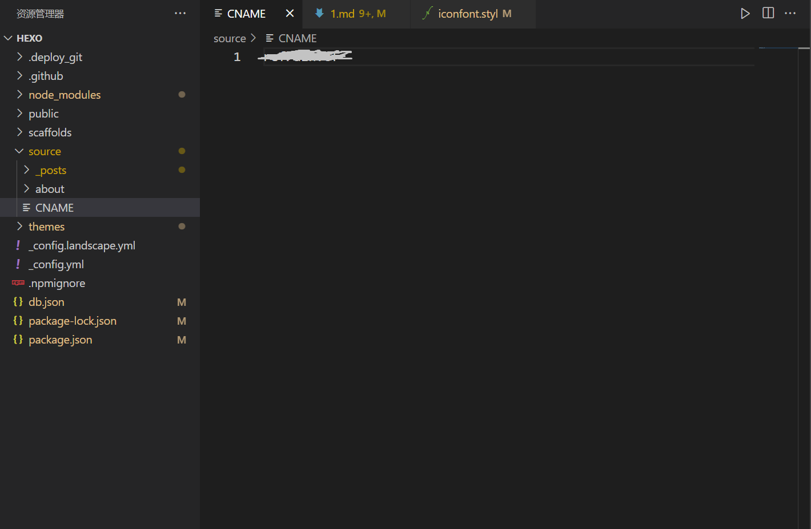
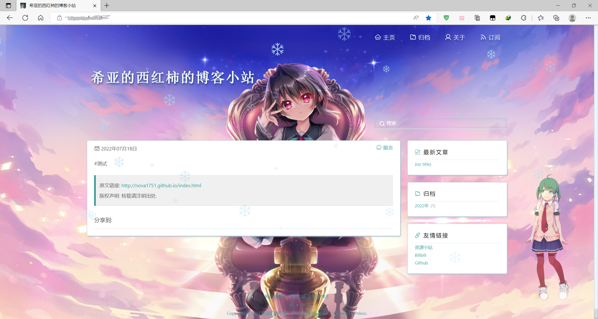

## 为hexo博客添加自定义域名
>域名注册方面不做赘述，下面详细讲述利用cloudflare中DNS解析域名至hexo博客站的过程
<!-- more-->
###  cloudflare中域名的解析
1. **注册cloudflare账号**(*~~过程比较简单就不放图了~~*，推荐使用gmail或者outlook邮箱)
2. **cloudflare中添加站点**
- 注意此处添加的站点为你所购买的域名

- 添加站点

- 注意你需要在域名管理网站中设置好对应的nameserver, ==每个人分配的服务器都不一样，**记得到注册域名的网站修改为对应的nameserver！！！**==

- 填写DNS解析域名的地址

###  将域名添加到github中
1. **进入到github项目中的settings中的pages中**

2. **此时项目main分支里会出现CNAME文件，内容为你的域名**(如 xxx.com)

3. **最后在本地的博客文件夹中`hexo/source`文件夹下新建CNAME文件，内容也为你所拥有的域名**、

> **最后输入域名博客站就可以正常访问啦！**
> 

